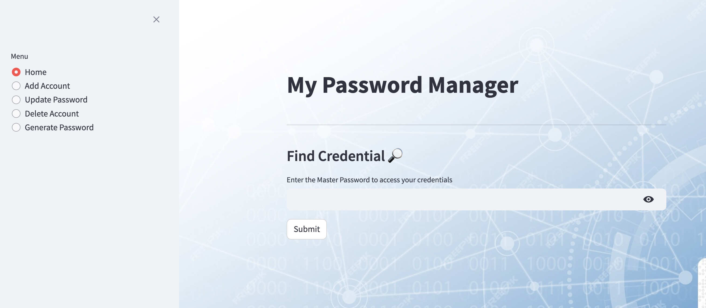
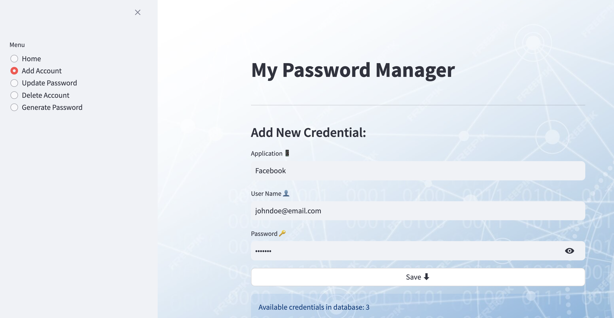

# Password Manager

##### Overview
This application serves as your DIY secure Password Manager, ensuring privacy of your sensitive data and access to all your credentials at any time.

##### Benefits
- No need of risking your accounts to Online privacy breach 
- Provides simple Interface to fetch, add, update and delete your app credentials 
- Includes a Strong Random Password Generator for quick signups

##### Run command
`streamlit run app.py`

##### Tools & Technologies Used
- **Python**: Programming Language of choice for building web applications. 
- **Streamlit**: Popular Python framework for building fast, data-intensive, visually appealing and interactive web applications.
- **cryptography** Python library for encryption 
- **SQLite3**: Provides lightweight and minimal complexity for relational database management system and performing CRUD operations.  

##### Snapshots

